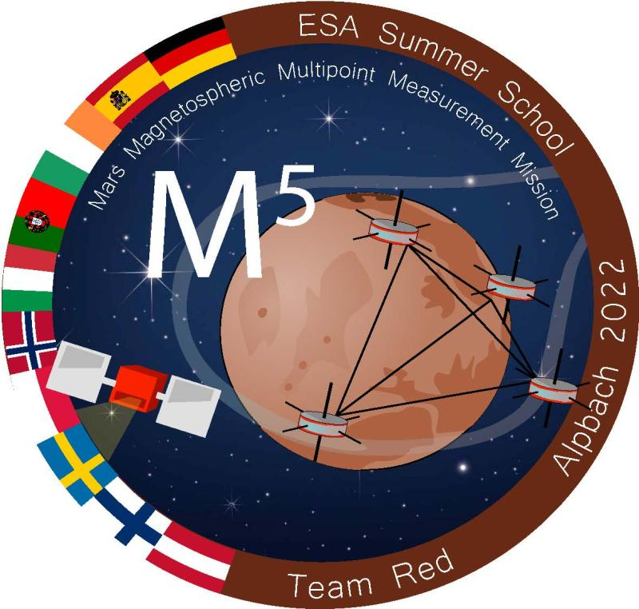

**Astract**:

Mars, lacking an intrinsic dynamo, is an ideal laboratory to comparatively study induced magnetospheres, which can be found in other terrestrial bodies as well as comets. Additionally, Mars is of particular interest to further exploration due to its loss of habitability by atmospheric escape and possible future human exploration. In this context, we propose the Mars Magnetospheric Multipoint Measurement Mission (M5), a multi-spacecraft mission to study the dynamics and energy transport of the Martian induced magnetosphere comprehensively. Particular focus is dedicated to the largely unexplored magnetotail region, where signatures of magnetic reconnection have been found. Furthermore, a reliable knowledge of the upstream solar wind conditions is needed to study the dynamics of the Martian magnetosphere, especially the different dayside boundary regions but also for energy transport phenomena like the current system and plasma waves. This will aid the study of atmospheric escape processes of planets with induced magnetospheres. In order to resolve the three-dimensional structures varying both in time and space, multi-point measurements are required. Thus, M5 is a five spacecraft mission, with one solar wind monitor orbiting Mars in a circular orbit at 5 Martian radii, and four smaller spacecraft in a tetrahedral configuration orbiting Mars in an elliptical orbit, spanning the far magnetotail up to 6 Mars radii with a periapsis just outside the Martian magnetosphere of 1.8 Mars radii. We not only present a detailed assessment of the scientific need for such a mission but also show the resulting mission and spacecraft design taking into account all aspects of the mission requirements and constraints such as mass, power, and link budgets. Additionally, different aspects of the mission programmatics like a possible mission timeline, cost estimates, or public outreach are shown. The common requirements for acceptance for an ESA mission are considered. The mission outlined in this paper was developed during the Alpbach Summer School 2022 on the topic of “Comparative Plasma Physics in the Universe”.

### More about M5

The M5 mission started more as a case study during the ESA Alpbach summer school which I participated, but then it developed to feasible and interesting space mission proposal. My contributions mostly focused on the engineering side from both a Systems and Structural engineer perspective. More specific information can be found [here](https://vascopires.github.io/portfolio/portfolio-1/).

